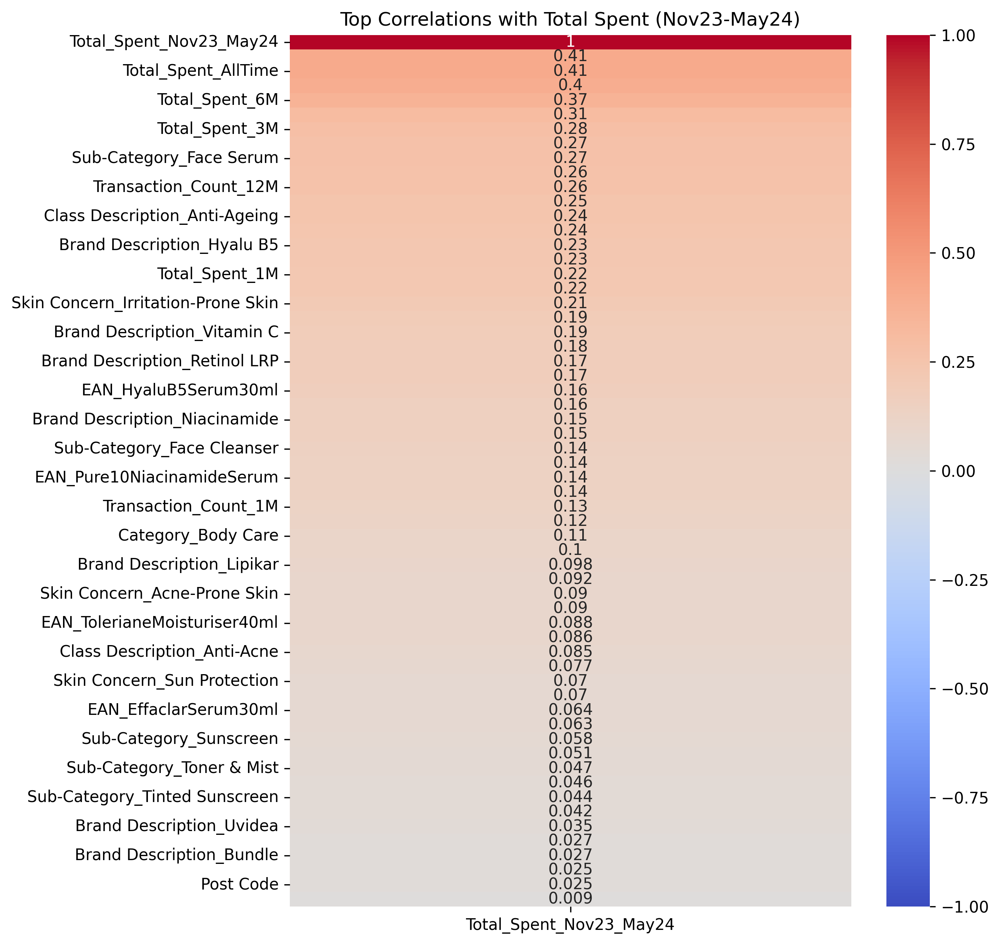
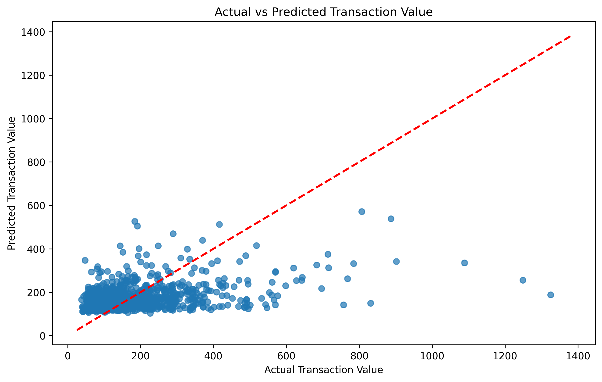
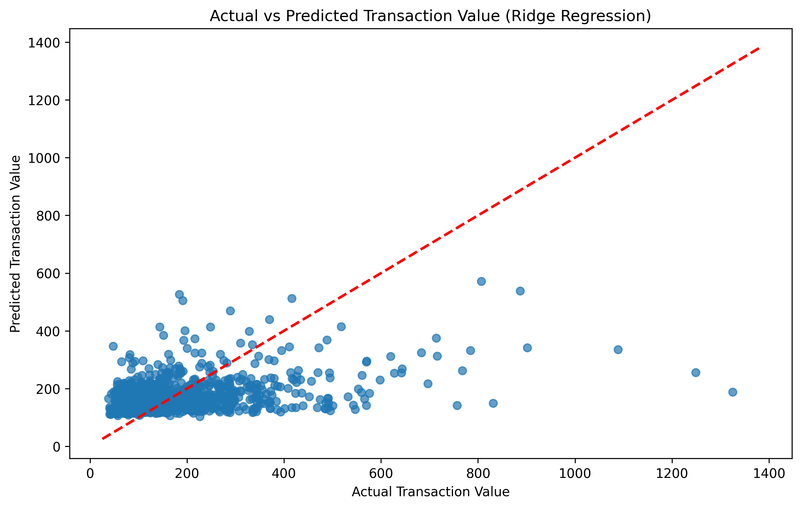

# Assignment 1
## Data Loading and Initial Analysis

1. **Loading the Dataset and Dictionary**:
    - We began by loading the main dataset from a CSV file and its corresponding data dictionary from an Excel file. The dataset contains information on customer transactions, while the data dictionary explains each feature's purpose.

    ```python
    data_df = pd.read_csv('/path/to/Project1Data.csv')
    data_dict_df = pd.read_excel('/path/to/Data_Dictionary_Project1.xlsx')
    ```

2. **Data Cleaning**:
    - After loading the data, we removed columns that were marked as "Remove" in the data dictionary. These columns were deemed unnecessary or irrelevant for our analysis, so they were excluded from the dataset.

    ```python
    columns_to_remove = data_dict_df[data_dict_df['Type'] == 'Remove']['Variable'].tolist()
    cleaned_data_df = data_df.drop(columns=columns_to_remove)
    ```

3. **Distribution of Transaction Values**:
    - We visualized the distribution of the `Total_Spent_Nov23_May24` variable, which represents the total amount spent by customers between November 2023 and May 2024. This histogram helps us understand the spread and skewness of the transaction values, providing insights into how most customers are spending.

    ```python
    plt.figure(figsize=(10, 6))
    sns.histplot(cleaned_data_df['Total_Spent_Nov23_May24'], kde=True, bins=30)
    plt.title('Distribution of Total Spent (Nov23-May24)')
    plt.xlabel('Total Spent')
    plt.ylabel('Frequency')
    plt.savefig('Distribution of Total Spent (Nov23-May24).png')
    ```

4. **Correlation Analysis**:
    - A function named `correlation_calculate()` was defined to compute the correlation matrix of the cleaned dataset. The function specifically identifies the top 15 features most correlated with `Total_Spent_Nov23_May24`. 
    - We visualized these correlations using a heatmap, highlighting the features that are most predictive of the total amount spent by customers. This heatmap serves as a crucial step in identifying the most important predictors for our subsequent analysis.

    ```python
    def correlation_calculate():
        correlation_matrix = cleaned_data_df.corr()
        top_correlations = correlation_matrix['Total_Spent_Nov23_May24'].sort_values(ascending=False).head(15)
        
        plt.figure(figsize=(8, 10))
        sns.heatmap(correlation_matrix[['Total_Spent_Nov23_May24']].sort_values(by='Total_Spent_Nov23_May24', ascending=False), annot=True, cmap='coolwarm', vmin=-1, vmax=1)
        plt.title('Top Correlations with Total Spent (Nov23-May24)')
        plt.savefig('correlation_heatmap.png', dpi=300, bbox_inches='tight')
        plt.show()

        return top_correlations
    ```


| Feature                    | Coefficient Value |
|----------------------------|-------------------|
| Total_Spent_AllTime         | 0.152893          |
| Total_Spent_6M              | 0.120919          |
| Total_Spent_12M             | 0.113293          |
| Total_Spent_9M              | 0.082908          |
| Sub-Category_Face Serum     | -0.058319         |
| Transaction_Count_12M       | -0.072238         |
| Skin Concern_Anti-Ageing    | -0.166256         |
| Category_Face Care          | -0.637993         |
| Transaction_Count_AllTime   | -7.606607         |
| Transaction_Count_9M        | -15.968261        |

## Selection of Statistical or Machine Learning Approaches

### Linear Regression

| Metric                      | Value               |
|-----------------------------|---------------------|
| Mean Squared Error (MSE)    | 13753.678141520708  |
| Root Mean Squared Error (RMSE) | 117.27607659501876 |
| R-squared (R²)              | 0.19067284401098894 |



Given that the linear regression model is not adequately capturing the relationship between the features and the target variable, we should consider more sophisticated models that might perform better. Two common alternatives in such scenarios are:

### Ridge Regression
This is a regularized version of linear regression that introduces a penalty on the size of the coefficients to prevent overfitting. Ridge regression is particularly useful when there is multicollinearity among the features, as it can improve model generalization.

> Ridge Regression RMSE: 117.27541028450636



The two plots for the Linear Regression and Ridge Regression models look almost identical because Ridge Regression is a regularized version of Linear Regression. When the regularization (controlled by the `alpha` parameter) is not too strong, Ridge Regression produces results similar to Linear Regression. Here are some key points to consider:

**Similar Model Behavior**:
- **Linear Regression**: It minimizes the sum of squared residuals between the observed and predicted values.
- **Ridge Regression**: It also minimizes the sum of squared residuals but adds a penalty term proportional to the sum of the squared coefficients (L2 regularization). This penalty term helps prevent overfitting by shrinking the coefficients.

