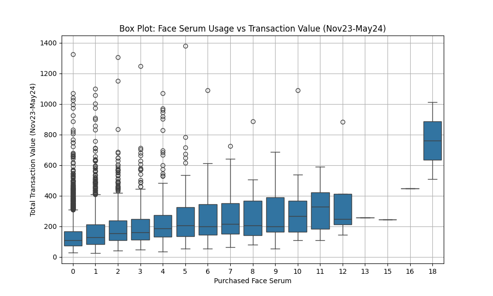

# Assignment 1
## Data Loading and Initial Analysis

1. **Loading the Dataset and Dictionary**:
    - We began by loading the main dataset from a CSV file and its corresponding data dictionary from an Excel file. The dataset contains information on customer transactions, while the data dictionary explains each feature's purpose.

    ```python
    data_df = pd.read_csv('/path/to/Project1Data.csv')
    data_dict_df = pd.read_excel('/path/to/Data_Dictionary_Project1.xlsx')
    ```
    The columns are:
    | Column Name                                      |
    |--------------------------------------------------|
    | CustomerID                                       |
    | Has_Transaction_Nov23_May24                      |
    | Total_Spent_Nov23_May24                          |
    | Total_Spent_1M                                   |
    | Transaction_Count_1M                             |
    | Total_Spent_3M                                   |
    | Transaction_Count_3M                             |
    | Total_Spent_6M                                   |
    | Transaction_Count_6M                             |
    | Total_Spent_9M                                   |
    | Transaction_Count_9M                             |
    | Total_Spent_12M                                  |
    | Transaction_Count_12M                            |
    | Total_Spent_AllTime                              |
    | Transaction_Count_AllTime                        |
    | Brand Description_Anthelios                      |
    | Brand Description_Bundle                         |
    | Brand Description_Cicaplast                      |
    | Brand Description_Eau Thermale                   |
    | Brand Description_Effaclar                       |
    | Brand Description_Hyalu B5                       |
    | Brand Description_Lipikar                        |
    | Brand Description_Niacinamide                    |
    | Brand Description_Retinol LRP                    |
    | Brand Description_Serozinc                       |
    | Brand Description_Toleriane                      |
    | Brand Description_Uvidea                         |
    | Brand Description_Vitamin C                      |
    | Class Description_Anti-Acne                      |
    | Class Description_Anti-Ageing                    |
    | Class Description_Body Care                      |
    | Class Description_Bundle                         |
    | Class Description_Face Care                      |
    | Category_Body Care                               |
    | Category_Face Care                               |
    | Category_Face Care                               |
    | Category_Sun Care                                |
    | Sub-Category_Body Moisturiser                    |
    | Sub-Category_Body Wash                           |
    | Sub-Category_Eye Cream                           |
    | Sub-Category_Face Cleanser                       |
    | Sub-Category_Face Mask                           |
    | Sub-Category_Face Moisturiser                    |
    | Sub-Category_Face Serum                          |
    | Sub-Category_Sunscreen                           |
    | Sub-Category_Tinted Sunscreen                    |
    | Sub-Category_Toner & Mist                        |
    | Skin Concern_Acne-Prone Skin                     |
    | Skin Concern_Anti-Ageing                         |
    | Skin Concern_Irritation-Prone Skin               |
    | Skin Concern_Pigmentation and Dark Spots         |
    | Skin Concern_Sun Protection                      |
    | EAN_TolerianeMoisturiser40ml                     |
    | EAN_HyaluB5Serum30ml                             |
    | EAN_EffaclarMoisturiser40ml                      |
    | EAN_VitaminC10Serum30ml                          |
    | EAN_RetinolB3Serum30ml                           |
    | EAN_EffaclarSerum30ml                            |
    | EAN_AntheliosInvisibleSunscreen50ml              |
    | EAN_Pure10NiacinamideSerum                       |
    | EAN_CicaplastB5BaumeBothSKUs40ml                 |


2. **Data Cleaning**:
    - After loading the data, we removed columns that were marked as "Remove" in the data dictionary. These columns were deemed unnecessary or irrelevant for our analysis, so they were excluded from the dataset.

    ```python
    columns_to_remove = data_dict_df[data_dict_df['Type'] == 'Remove']['Variable'].tolist()
    cleaned_data_df = data_df.drop(columns=columns_to_remove)
    ```

3. **Distribution of Transaction Values**:
    - We visualized the distribution of the `Total_Spent_Nov23_May24` variable, which represents the total amount spent by customers between November 2023 and May 2024. This histogram helps us understand the spread and skewness of the transaction values, providing insights into how most customers are spending.

    ```python
    plt.figure(figsize=(10, 6))
    sns.histplot(cleaned_data_df['Total_Spent_Nov23_May24'], kde=True, bins=30)
    plt.title('Distribution of Total Spent (Nov23-May24)')
    plt.xlabel('Total Spent')
    plt.ylabel('Frequency')
    plt.savefig('Distribution of Total Spent (Nov23-May24).png')
    ```

4. **Correlation Analysis**:
    - A function named `correlation_calculate()` was defined to compute the correlation matrix of the cleaned dataset. The function specifically identifies the top 15 features most correlated with `Total_Spent_Nov23_May24`. 
    - We visualized these correlations using a heatmap, highlighting the features that are most predictive of the total amount spent by customers. This heatmap serves as a crucial step in identifying the most important predictors for our subsequent analysis.

    ```python
    def correlation_calculate():
        correlation_matrix = cleaned_data_df.corr()
        top_correlations = correlation_matrix['Total_Spent_Nov23_May24'].sort_values(ascending=False).head(15)
        
        plt.figure(figsize=(8, 10))
        sns.heatmap(correlation_matrix[['Total_Spent_Nov23_May24']].sort_values(by='Total_Spent_Nov23_May24', ascending=False), annot=True, cmap='coolwarm', vmin=-1, vmax=1)
        plt.title('Top Correlations with Total Spent (Nov23-May24)')
        plt.savefig('correlation_heatmap.png', dpi=300, bbox_inches='tight')
        plt.show()

        return top_correlations
    ```

### Feature A: ```Sub-Category_Face Serum```


